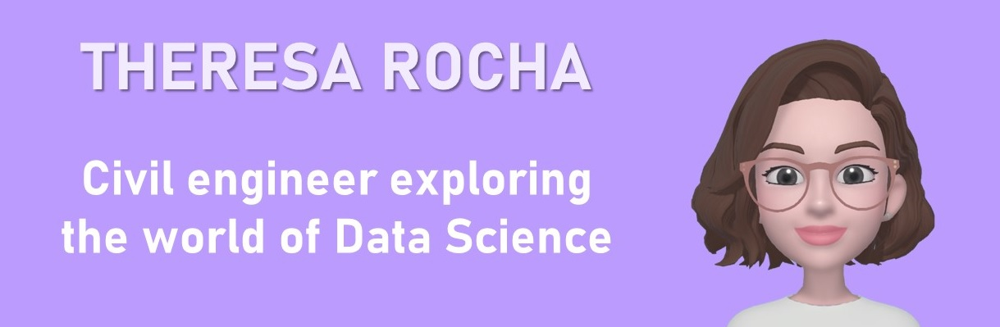

# Hi, I'm Theresa (ela/she) 👋🙂

I'm a civil engineer exploring the world of Data Science. I want to improve my hard and soft skills while working on projects, learning, experiencing and sailing in the journey.

### About me 👩

- 👩‍🎓 Bachelor of Civil Engineering
- 👷‍♀️ Have a certificate in Worplace Safety
- 👩‍🏫 Worked as an English teacher
- 💖 Love teaching and sharing knowledge
- 👩‍🍳 Love cooking although I'm not a pro
- 🎬 I like doramas and k-pop music

### Skills - Learning and improving 👩‍💻

- 🗽 Fluent English
- 🐍 Python
- 📑 SQL
- 💻 Power BI
- 📊 Data Visualization

### Projects

[Projects using Power BI Desktop](https://github.com/theresarocha/projetos_dashboards)

### Get in touch 

- [Linkedin](https://www.linkedin.com/in/theresarocha/)
- [Blog](https://www.flai.com.br/theresarocha/)
